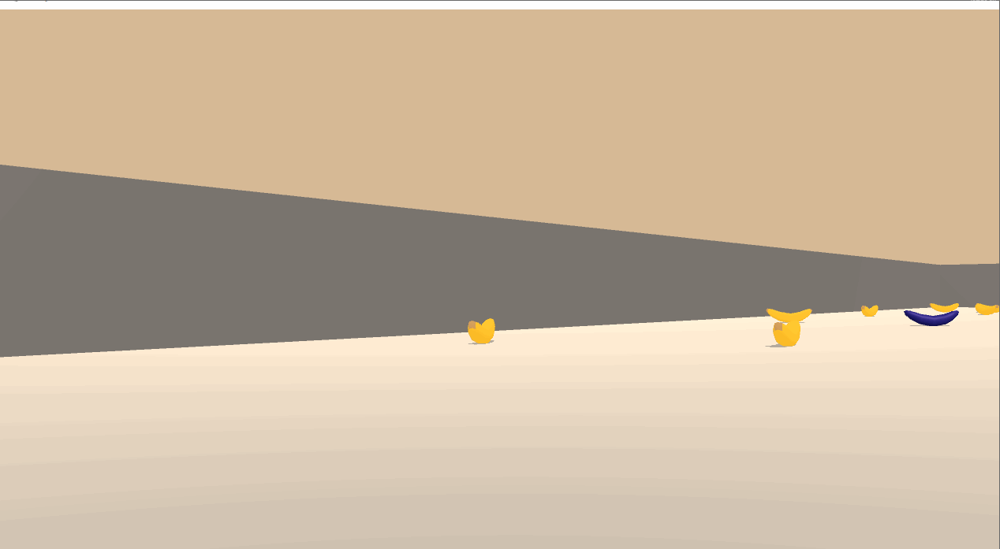

**DRLND Banana Navigation Project**

This project reflects the knowledge acquired of the first module of reinforcement learning with an applied project.   


**Environment**

A reward of +1 is provided for collecting a yellow banana, and a reward of -1 is provided for collecting a blue banana. Thus, the goal of your agent is to collect as many yellow bananas as possible while avoiding blue bananas.

The state space has 37 dimensions and contains the agent's velocity, along with ray-based perception of objects around the agent's forward direction. Given this information, the agent has to learn how to best select actions. Four discrete actions are available, corresponding to:

* 0 - move forward.
* 1 - move backward.
* 2 - turn left.
* 3 - turn right.

The task is episodic, and in order to solve the environment, your agent must get an average score of +13 over 100 consecutive episodes.
## Instructions to run the project 

Next you will find information to configure the right environment and run the agent. 
The main notebooks are Report.ipynb, main.py to play with trained agent and train_agent.py to train a new agent in two available configurations: 
   
    - DQN (vanilla_dqn) 
    - Double DQN (double_dqn)

### Dependencies

To set up your python environment to run the code in this repository, follow the instructions below.

1. Create (and activate) a new environment with Python 3.6.


- __Linux__ or __Mac__: 
	```bash
	conda create --name drlnd python=3.6
	source activate drlnd
	```
- __Windows__: 
	```bash
	conda create --name drlnd python=3.6 
	activate drlnd
	```
	
2. If running in **Windows**, ensure you have the "Build Tools for Visual Studio 2019" installed from this [site](https://visualstudio.microsoft.com/downloads/).  This [article](https://towardsdatascience.com/how-to-install-openai-gym-in-a-windows-environment-338969e24d30) may also be very helpful.  This was confirmed to work in Windows 10 Home.  

3. Follow the instructions in [this repository](https://github.com/openai/gym) to perform a minimal install of OpenAI gym.  
	
4. Clone the repository (if you haven't already!), and navigate to the `python/` folder.  Then, install several dependencies.  
    ```bash
    git clone https://github.com/udacity/deep-reinforcement-learning.git
    cd deep-reinforcement-learning/python
    pip install .
    ```

5. Create an [IPython kernel](http://ipython.readthedocs.io/en/stable/install/kernel_install.html) for the `drlnd` environment.    
    ```bash
    python -m ipykernel install --user --name drlnd --display-name "drlnd"
    ```

6. Clone the repository (if you haven't already!), and explore the Report.ipynb notebook.  Then, install several dependencies.  
    ```bash
    git clone https://github.com/alekcei1510/Banana-project-udacity.git
    ```

7. Before running the code for train the agent or get the analysis, change the kernel to match the `drlnd` environment by using the drop-down `Kernel` menu. 

## Before training the agent

You need to configure the correct unity environment for simulations depending on your operating system.

- Linux: [click here](https://s3-us-west-1.amazonaws.com/udacity-drlnd/P1/Banana/Banana_Linux.zip)
- Mac OSX: [click here](https://s3-us-west-1.amazonaws.com/udacity-drlnd/P1/Banana/Banana.app.zip)
- Windows (32-bit): [click here](https://s3-us-west-1.amazonaws.com/udacity-drlnd/P1/Banana/Banana_Windows_x86.zip)
- Windows (64-bit): [click here](https://s3-us-west-1.amazonaws.com/udacity-drlnd/P1/Banana/Banana_Windows_x86_64.zip)

Then, place the file in the `p1_navigation/` folder in the DRLND GitHub repository, and unzip (or decompress) the file. 
Finally, reference the file like this: 

`env = UnityEnvironment(file_name="deep-reinforcement-learning/p1_navigation/Banana_Windows_x86_64/Banana.exe")`

in the `train_agent.py` file to run the project.

## Train the agent

The default configuration is one of the chosen after many simulations and it works very well to resolve the change. 
You can explore more configurations and how it affects the performance of the agent. The main file to train the agent is `train_agent.py` and the file of trained weights can be found on the directory of `trained_agents`.


## Play with the agent
You can run the agent trained with the script `run_agent.py`, the default configuration is windows on the line `env = UnityEnvironment(file_name="deep-reinforcement-learning/p1_navigation/Banana_Windows_x86_64/Banana.exe")`

The expected output is something is: 

