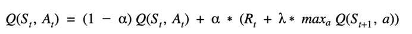
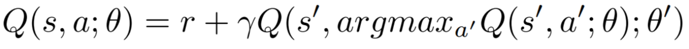
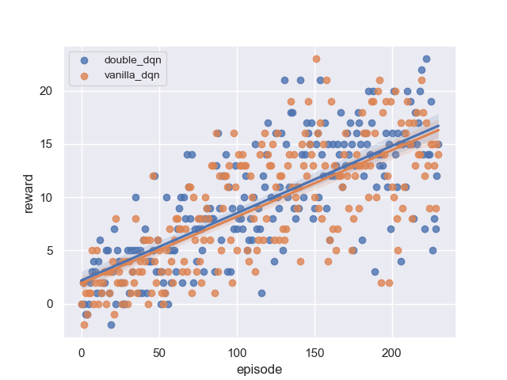

**DRLND Banana Navigation Project**

This experiment was done in the following way:

1. Tried to run a simple agent with a basic configuration possible. 
2. Try to tune some hyper-parameters to get a better result.
3. Implement a double-DQN agent.
4. Compare results over the two experiments

    - DQN (vanilla_dqn) 
    - Double DQN (double_dqn)

### Algorithm's used

The implementation for each algorithm is based on the bellman's equation for updates:

#### Architecture of the DQN used in the experiment
 
* Fully connected linear neural network with 3 layers of 64 units and RLU activation in the first two layers.

#### DQN (vanilla_dqn)

#### Double DQN (double_dqn)

### Resume experiment

Both implementation had running in the same environment. Getting the next results: 

To check the weights of the neural network, you can check it in the folder of `trained_agents` with the name corresponding to the algorithm used.

An important issue is the application of the same configuration with different algorithms, this can be tuned to improve the performance of each algorithm with specific hyper-parameters for each of one.

In the graph, we can see that the double-DQN algorithm is slighter better than the vanilla-DQN algorithm.
But with more hyper-parameters tuning the algorithm can achieve more stability over time. 

Despite the little difference, both algorithms are capable of achieve the goal of the task, getting to the average score of +13 over 100 consecutive episodes.

### Improving future results 
* Try to tune the hyper-parameters to get a better result on each configuration and type of algorithm. 
* Try to implement a different architecture like rainbow, combining different approaches to get a better convergence.